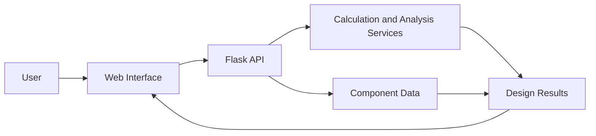
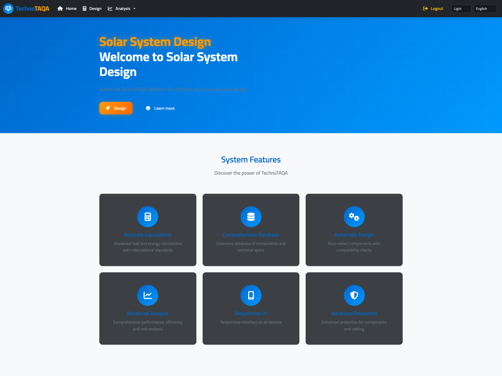
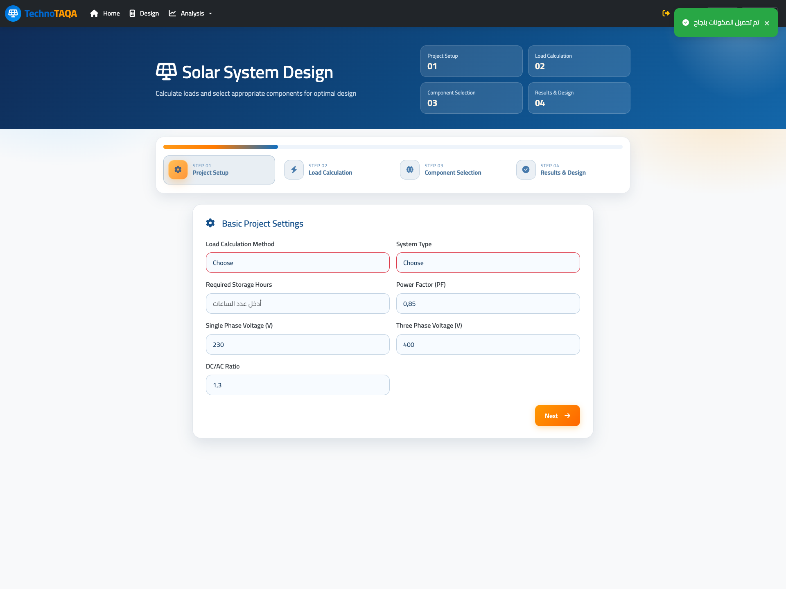
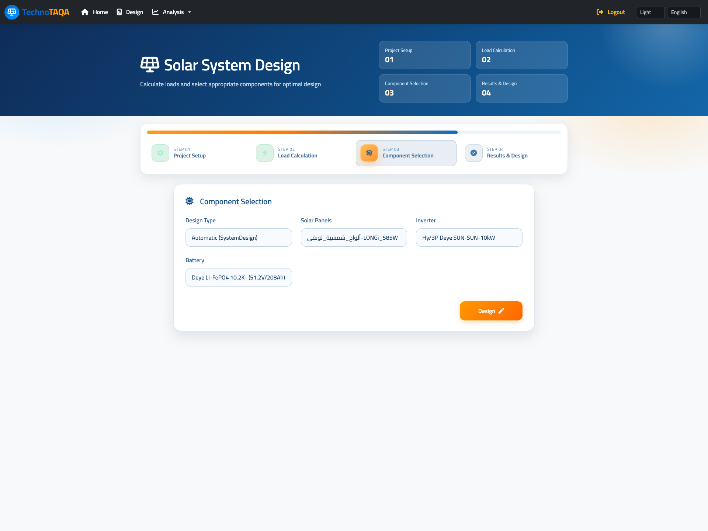
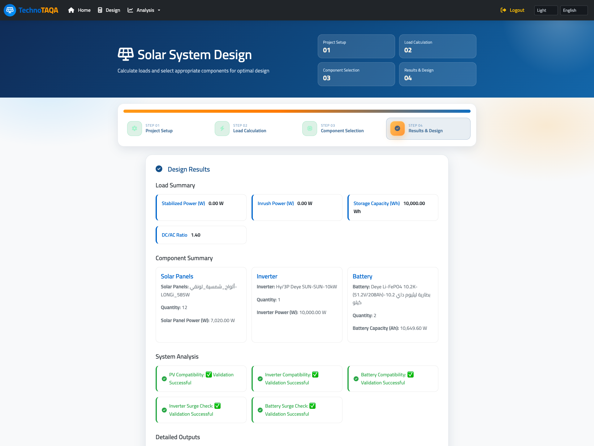

# Solar System Design Web Application

A full-stack web application for designing solar energy systems, calculating electrical loads, selecting compatible components, and reviewing project analysis dashboards.

## Overview

The application turns a solar system design workflow into an interactive web experience. It supports electrical load calculation, PV/inverter/battery selection, system validation, cost summaries, and engineering dashboards through a clean bilingual interface.

## Features

- Multi-step solar design workflow.
- Single-phase and three-phase load calculations.
- Automatic and manual component selection.
- PV, inverter, and battery compatibility checks.
- Cost and quotation summary.
- BOM dashboard.
- Feasibility dashboard.
- PV simulation dashboard.
- System diagram dashboard.
- Arabic RTL and English interface support.
- Responsive layout for desktop and mobile screens.

## Tech Stack

- Python
- Flask
- SQLite
- HTML
- CSS
- JavaScript
- Bootstrap
- Jinja templates
- PDF report generation

## Architecture

## Screenshots

### Home

### Design Setup

### Component Selection

### Design Results

